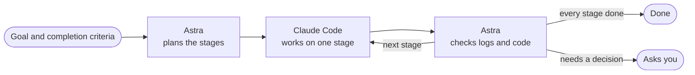

<h1 align="center">lavista</h1>

<p align="center">
  <b>Astra plans. Claude Code executes. Astra verifies.</b><br>
  Write one goal, and lavista works through it stage by stage until its completion criteria are met.
</p>

<p align="center">
  <a href="https://github.com/takuma-shishido/lavista/actions/workflows/ci.yml"></a>
  <a href="LICENSE"></a>
  
  
</p>

<p align="center">
  
</p>
<p align="center">
  <sub>A real run, recorded with the agents' part sped up</sub>
</p>

## What is lavista?

Hand Claude Code a large task in one go and it may stop halfway, or report "done" when it isn't. lavista splits the work between two agents to prevent that:

- **Astra** (Codex CLI) splits the goal into stages. After every step it reads Claude's log and the project, read-only, decides whether the stage's completion criteria are met, and writes the next instruction.
- **Claude Code** works on one stage at a time, each in a fresh session.



## Features

- **Completion is judged on evidence**: Astra reads the tool calls, their results and the project itself instead of taking Claude's word for it.
- **A fresh session for every stage**: long conversations don't degrade the context, and the plan is revised after every review.
- **Side-by-side TUI**: both agents' thinking, tool calls, results and the current stage, live.
- **Permission prompts in place**: Claude runs in auto mode; only the actions that need your approval are asked in the TUI (<kbd>y</kbd> / <kbd>a</kbd> / <kbd>n</kbd>).
- **Stop and pick up again**: all state and logs are kept in `.lavista/runs/`. After an interruption, a failure or a usage limit, continue with `resume` or `retry`.
- **Parallel runs**: several runs can work in the same project at once; each agent is told what the others are doing and to keep clear of it.

> [!WARNING]
> Claude edits files and runs commands in the current directory on its own, in auto mode. Changes land in place, and lavista cannot undo them.
> - Run it in a git repository and commit first, or in a separate working copy such as a `git worktree`.
> - Do not run it where there are secrets or data you cannot afford to lose.
> - Claude and Codex usage is billed to your own accounts.

## Installation

Install [Claude Code](https://docs.anthropic.com/en/docs/claude-code) and [Codex CLI](https://github.com/openai/codex) and log in to both. Node.js 22.12 or later is required.

```sh
git clone https://github.com/takuma-shishido/lavista.git
cd lavista
npm ci && npm run build && npm link
```

> [!NOTE]
> Tested with Claude Code 2.1.281 and codex-cli 0.153.4. lavista reads both CLIs' output formats, so a CLI update may break it.

## Quick start

```sh
cd /path/to/project
lavista start
```

1. Pick the models and efforts from a list (skipped for those set in the config or as flags).
2. Your editor opens (`$VISUAL`, then `$EDITOR`, then `vi`). Write the goal and its completion criteria, then save and quit to start. Quitting with it empty cancels.
3. Watch the TUI. <kbd>q</kbd> or <kbd>Ctrl</kbd>+<kbd>C</kbd> stops the run; press it again to kill the agents at once.

The goal is saved with the run's logs as `.lavista/runs/<run>/goal.md`. `.lavista/runs/` is git-ignored, so no task file is left in your working tree.

<details>
<summary>Example goal</summary>

The goal from the demo:

```text
Implement slugify(text) in src/slug.js.
- Lowercase the text and turn each run of non-alphanumeric characters into one hyphen
- Trim leading and trailing hyphens
Done when: test/slug.test.js covers these rules and npm test passes
```

Astra splits the work into stages and judges completion from these criteria, so criteria it can check (tests pass, a command prints something) make the judgement reliable. You can write the goal in any language: Claude's instructions are written in English, and Astra explains its decisions in the language of your goal.

</details>

## Usage

### When Astra needs a decision

When the goal leaves open a choice Astra should not make for you, it asks instead of guessing. The run stops with the question; `lavista answer` opens your editor with the question shown below the line, and Astra decides again with your answer added to the goal.

<p align="center">
  
</p>

### Commands

| Command | Description |
|---|---|
| `lavista start [file]` | Start a new run. With `file`, the editor starts from its text |
| `lavista status [run]` | Print the run's state and plan |
| `lavista resume [run]` | Continue a stopped run (e.g. after Astra failed or a usage limit) |
| `lavista retry [run]` | Retry a failed Claude step in a fresh session |
| `lavista review [run]` | Have Astra judge a saved Claude result |
| `lavista answer [run]` | Answer Astra's question (`needs_input`) in the editor and let it decide again |

`[run]` defaults to the latest run; `resume`, `retry`, `review` and `answer` skip runs another lavista is working on. A run stopped by a usage limit exits with code 75.

Off a terminal (pipes, CI) no editor can open, so the file given to `lavista start <file>` or `lavista answer --file <file>` is used as is.

### Permission prompts

Auto mode's classifier decides most actions. Only those that need your approval appear in the TUI, with a desktop notification on macOS.

| Key | Action |
|---|---|
| <kbd>y</kbd> | Allow this once |
| <kbd>a</kbd> | Allow matching actions for the rest of the run (the rule shown is saved with the run) |
| <kbd>n</kbd> | Deny |

<details>
<summary>Details</summary>

- Time spent waiting for your answer does not count toward `timeout`.
- Actions the classifier denies are denied on the spot, without a prompt. They are listed, and the step goes on to review.
- To allow an action every time, add a rule to `allowed_tools`.
- Off a terminal, every action that needs approval is denied.

</details>

### Background work

If Claude ends its turn while a build or other background job it started is still running, lavista keeps the session open until the job finishes (the TUI shows `waiting for background work`). Claude then continues in the same session, and the step ends once nothing is left running. This wait does not count toward `timeout`.

### Parallel runs

Running `lavista start` from another terminal in the same project starts a second run alongside the first. Each run's agents are given the other runs' goals and current stages and told to keep clear of that work. The working directory is shared, so give the runs goals that don't overlap.

## Configuration

Settings go in `.lavista/config.json` (shared) and `.lavista/config.local.json` (personal; takes precedence). For models and efforts, the `lavista start` flags (`--claude-model`, `--claude-effort`, `--astra-model`, `--astra-effort`) take precedence over both.

```json
{
  "claude_model": "claude-opus-5-5",
  "claude_effort": "high",
  "astra_model": "gpt-6-astra",
  "astra_effort": "xhigh",
  "allowed_tools": "Bash(npm test)"
}
```

<details>
<summary>All settings</summary>

| Key | Default | Description |
|---|---|---|
| `claude_model` / `claude_effort` | picked from a list | Claude's model and effort. `""` uses the CLI's own setting |
| `astra_model` / `astra_effort` | picked from a list | Astra's model and effort. `""` uses the CLI's own setting |
| `allowed_tools` | `""` | Tool rules Claude may use without asking, e.g. `"Bash(npm test)"`. Rules approved with <kbd>a</kbd> are saved in the run's `approved_tools` and used as well |
| `max_iterations` | `20` | Maximum number of Claude steps |
| `timeout` | `1800` | Stop a CLI after this many seconds without output (waiting for you or for background work excluded) |

The chosen models and efforts are passed to each CLI as flags for that run only; `~/.claude` and `~/.codex/config.toml` are never changed.

</details>

## Development

```sh
npm run check   # type check
npm test        # tests
```

## License

[MIT](LICENSE)
